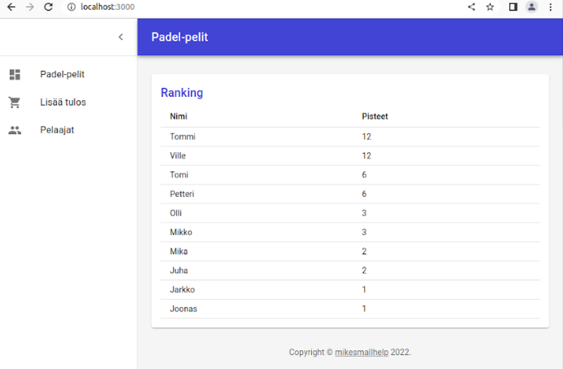
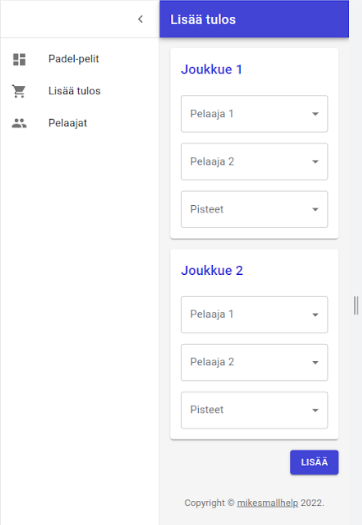

# Padel ranking application

## Application

With the simple padel ranking application you can register game results and the application calculates ranking. 

Example of the ranking calculation: When the player wins four sets his ranking goes up with four points.

At home page you can see the ranking:



You can add new result in this page:


When you are in the mobile device adding the new result looks like this:



## Technology

The technology stack is:

- Next.js framework
- React and MUI for the layout
- MUI dashboard template
- Prisma for the database access
- Next.js api routes

Good introduction to the Next.js development is for example [How to Build a Fullstack App with Next.js, Prisma, and PostgreSQL](https://vercel.com/guides/nextjs-prisma-postgres)

## Installation

### These are needed

- npm
- npx
- PostreSQL database
  - padel-ranking/.env file configures the database connection

### Installation

Clone the repository and go to the padel-ranking folder. First install npm libraries:

```
npm install
```

Then push your database schema to the database:

```
npx prisma db push
```

Add some players to the database with the Prisma studio:

```
npx prisma studio
```

Generate the Prisma client

```
npx prisma generate
```

Note: the Prisma client is under the node_modules folder and not in the Git.

Start the application:

```
npm run dev
```

Open your browser in the localhost:3000.


